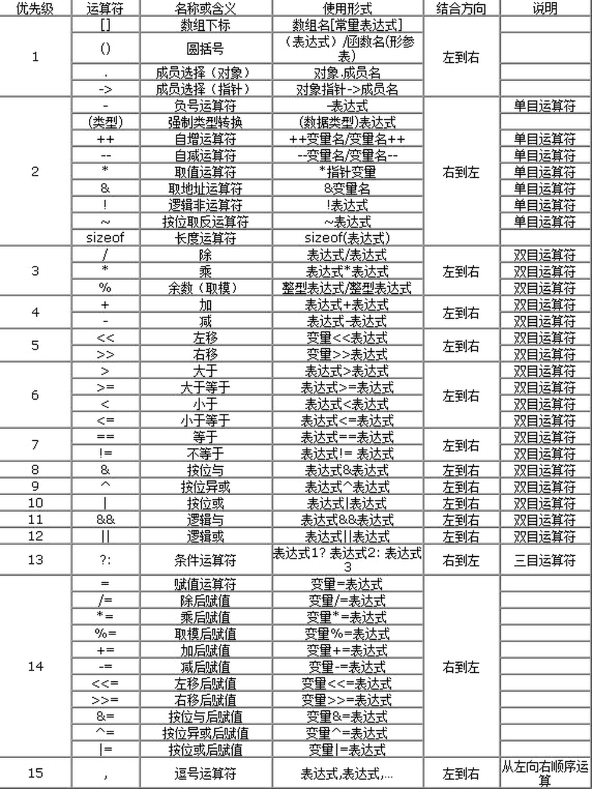

# 第四章——运算符

## 1. 什么是运算符

运算符是一种告诉编译器执行特定的数学或逻辑操作的符号。

通常运算符分以下几类：

- **算术运算符**
- **关系运算符**
- **逻辑运算符**
- **赋值运算符**
- **位运算符**
- **其他运算符**

## 2. 算术运算符

| 运算符 |       描述       |             示例              |
| :----: | :--------------: | :---------------------------: |
|   +    | 将两个操作数相加 |         int a = 5+6;          |
|   -    | 将两个操作数相减 |         int a = 5-6;          |
|   \*   | 将两个操作数相乘 |         int a = 5\*6;         |
|   /    | 将两个操作数相除 | int a = 5/2; float b = 5/2.0; |
|   %    |     取模运算     |         int a = 5%2;          |
|   ++   | 将自身体的值加1  |      int a = 12;a++;++a;      |
|   --   | 将自身体的值减1  |      int a =12;a--;--a;       |

## 3. 关系运算符

| 运算符 |               描述               |         示例          |
| :----: | :------------------------------: | :-------------------: |
|   ==   |      判断两个操作数是否相等      | bool result = (4==5); |
|   !=   |     判断两个操作数是否不相等     | bool result = (4==5); |
|   >    |   判断一个操作数是否大于另一个   | bool result = (4>5);  |
|   <    |   判断一个操作数是否小于另一个   | bool result = (4<5);  |
|   >=   | 判断一个操作数是否大于等于另一个 | bool result = (4>=5); |
|   <=   | 判断一个操作数是否小于等于另一个 | bool result = (4<=5); |

## 4. 逻辑运算符

| 运算符 |  描述  |               示例               |
| :----: | :----: | :------------------------------: |
|   &&   | 且运算 |   bool result = (4==5)&&(4<3);   |
|  \|\|  | 或运算 | bool result = (4==5) \|\| (4<3); |
|   ！   | 非运算 |      bool result = !(4>5);       |

## 5. 赋值运算

| 运算符 |                 描述                 |        示例        |
| :----: | :----------------------------------: | :----------------: |
|   =    |        右操作数赋值给左操作数        |  int a = 12; a=6;  |
|   +=   |  右操作数加上左操作数赋值给左操作数  | int a = 12; a+=6;  |
|   -=   | 右操作数减去上左操作数赋值给左操作数 | int a = 12; a-=6;  |
|  \*=   |  右操作数乘上左操作数赋值给左操作数  | int a = 12; a\*=6; |
|   /=   |  右操作数除以左操作数赋值给左操作数  | int a = 12; a/=6;  |
|   %=   |  右操作数取模左操作数赋值给左操作数  | int a = 12; a%=6;  |

## 6. 其他运算符

| 运算符 |                描述                |           示例           |
| :----: | :--------------------------------: | :----------------------: |
| sizeof | 获取某一个变量所占存储空间的字节数 | int a;int b = sizeof(a); |
|   ?    |             条件表达式             |    int a = (4>5)?4:5;    |
|   &    |           返回变量的地址           |   int a =12;int b =&a;   |
|   \*   |        指针变量指向一个变量        | int a = 12; int \*b=\*a; |

## 7. 运算符优先级和结合性

在表达式中，优先级较高的先于优先级较低的进行运算。

而在一个运算量两侧的运算符优先级相同时，则按运算符的结合性所规定的结合方向处理，即左结合和右结合。

