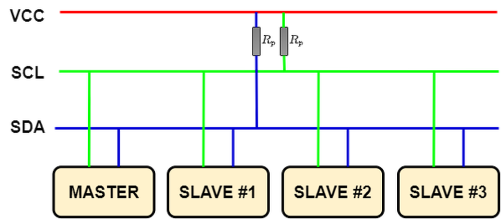

# I2C

## 1. 什么是 I2C

I2C(Inter-Integrated Circuit)，也称为 IIC，\\(I^2C\\)是一种**同步**，**多主从设备**的一种**串行**通信方式，由 Philips 半导体公司发明于 1982 年。是继 UART 第二种更常用的单片机通信方式，UART 主要用于**板间通信**，如单片机和电脑，而 I2C 多用于**板内通信**，如单片机和其他传感器等。

I2C 最大的一个优势就是可以同时连接多个设备，每个设备都有自己独特的地址，主机通过这个地址和设备进行通信。而且其中任何一台设备都可以成为主机，也都可以相互通信，只要知道对方的地址即可。但任意时刻只能有一个主机。

## 2. I2C 的外设

一般 I2C 设备都需要在两条总线上添加上拉电阻组成一个**开漏电路**。由于所有的 SCL 都接在一起，所有的 SDA 都接在一起，因此，各个设备之间是‘与’关系。也就是说，只有所有的设备是高电平总线才是高电平，任何一个设备是低电平都会拉低总线，任何一个设备也就都能成为主机。

