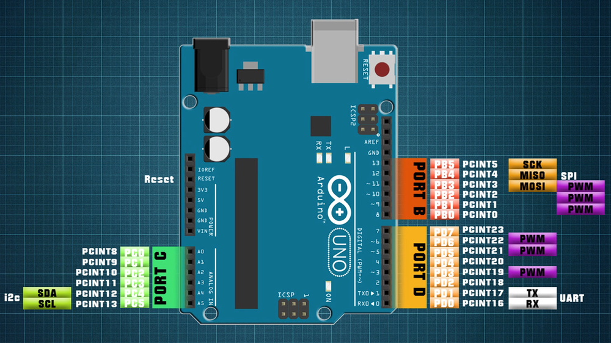
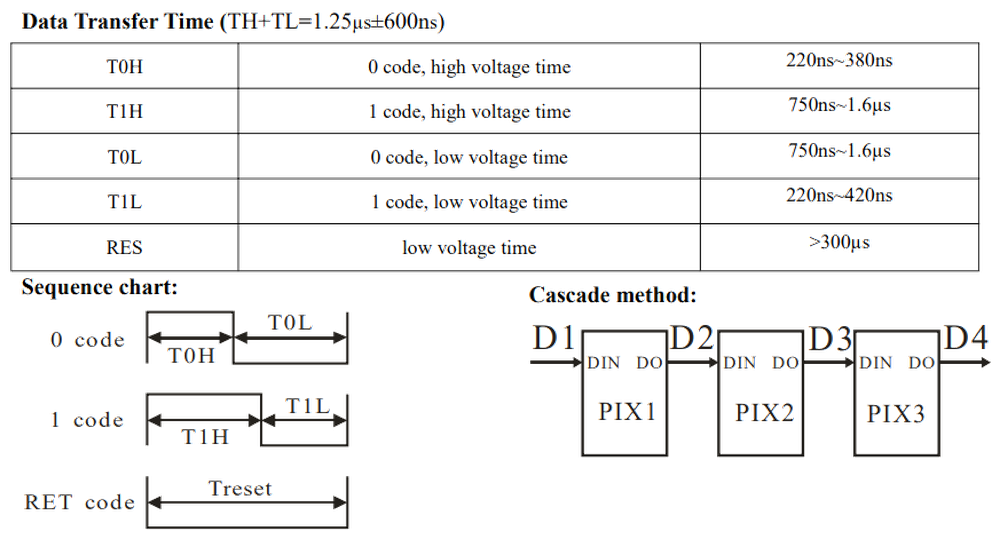

# 第五章——总结和拓展

## 1. 拓展一

通过实践可以发现，One—Wire 非常重要的就是获取高低电平的时间，其实红外接收管的的信号也是由**开始信号+用户码+用户码(用户反码)+按键码+按键反码+结束信号**组成，通信过程几乎一致，感兴趣的同学可以自行查阅相关资料对红外信号进行解码。

下面是 NEC 协议的红外遥控的方波图：

## 2. 拓展二

由于通信对时序的要求很高，我们在代码中使用的是**digitalWrite()** 和 **pinMode()** 两个 Arduino 已经为我们封装好的函数，其实更好的方法是通过寄存器进行操作，提高效率。但这样同时也会增加编程的难度。

感兴趣的同学可以参考下面的文章进行学习 [AVR I/O Register Configuration](https://exploreembedded.com/wiki/AVR_I/O_Register_Configuration)。

## 3. 拓展三

前面我们学习的是接收 One-Wire 发送的数据包，而 One-Wire 的数据发送对时序的要求更高，我们一般不直接通过软件实现对数据的发送，而是结合相应的硬件发送数据，如 PWM，Timer，DMA，PIO 等等。

下面以 WS2812 和 DHT11 的时序作对比：

| bit |       WS2812        |      DHT11      |
| :-: | :-----------------: | :-------------: |
| ‘0’ | 0.40us H + 0.85us L | 50us L + 27us H |
| ‘1’ | 0.80us H + 0.45us L | 50us L + 70us H |

下面是 WS2812 的时序表，想挑战一下的同学可以尝试如何自己驱动点亮 WS2812：

