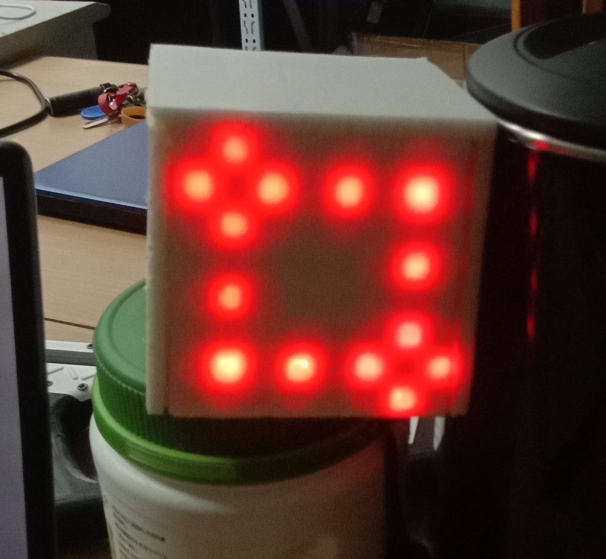
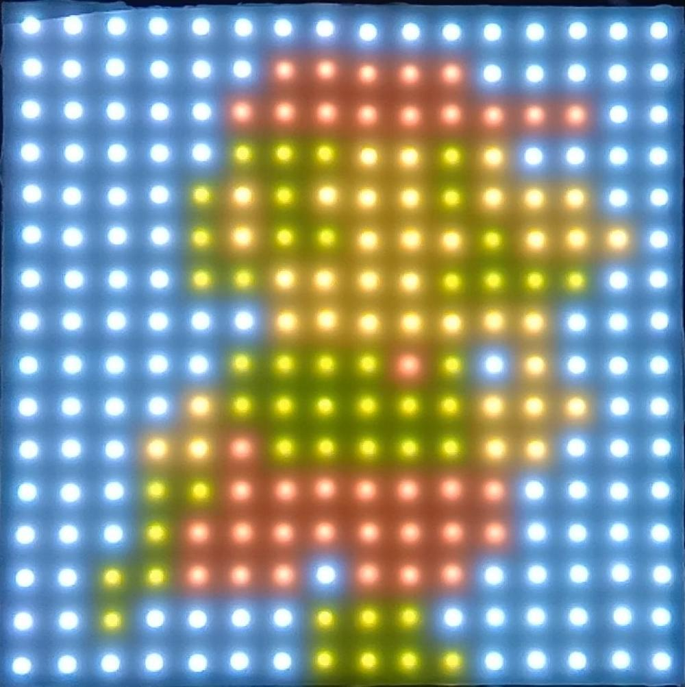

# 第三章——总结和拓展

其实围绕着WS2812，我制作了很多的项目，也在每个项目上做了很多的改进，有简单的，也有复杂的，其中一些对做我其他项目的制作也有很大帮助。

## 1. 桌面灯条

比如我带电子组制作的LED灯条，虽然我没有把这个项目放到GitHub上，但是我也带着大家亲手做了，从焊接板子，到学习FastLED库，再到整合代码，相信大家还有印象。有点懒，不想整理文件了，大家自己学习。目前我的桌子下面就用的是这个灯条，我还给它添加了电源以及充电的功能，总的来说挺好用的，也很好看。

## 2. 初代8x8灯阵

我在大一结束的那个暑假的时候，又制作了一个8x8的灯阵。这个灯阵有着丰富的变化，可以显示数字和IP地址以及字母，能够用WIFI控制灯阵，还有画画的功能。其实这也是我首次在ESP32上使用WIFI的功能。

大家可以前往我的[GitHub仓库](https://github.com/MR-Addict/8X8-LED-Matrix-using-ESP32-Web-Server.git)参考相关内容。

## 3. 进阶灯阵

大概是在我大二上学期金工实习的那段时间，我完成了WS2812更加进阶的功能。其大小不在只局限于8x8，而是任意的分辨率，而且支持多种灯条连接模式，支持自定义字体显示，不局限于数字和字母，还有其他字，同样支持画直线，画圆，画矩形等图形，最后还能显示图片。和普通的屏幕已经无异了，这为我后来编写其他屏幕驱动打下了基础。

大家可以前往我的这个[GitHub仓库](https://github.com/MR-Addict/WS2812LED-Matrix-Library.git)下载使用这几个库。

后来我借助这个库，制作了另一个项目[SmartLED](https://github.com/MR-Addict/SmartLED.git)大部分也就是上面提到的功能，我记得我还在这个灯阵上写了一个贪吃蛇的游戏，有兴趣的可以去看一下。

