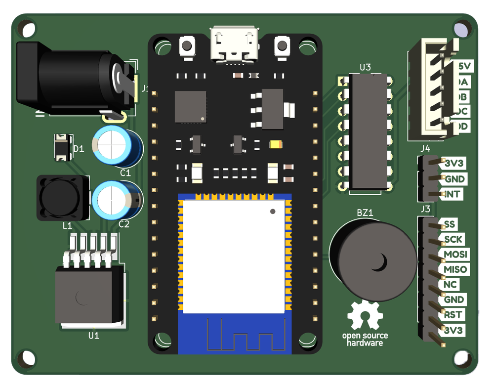
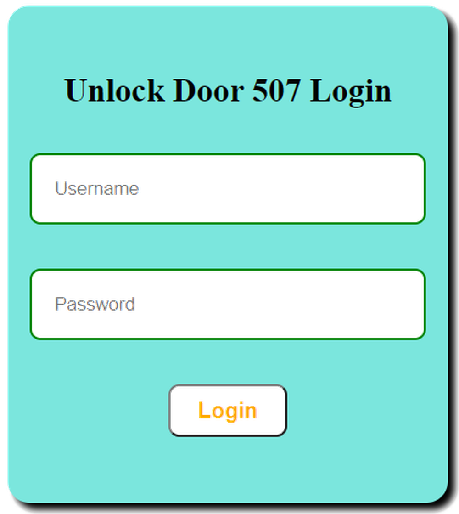
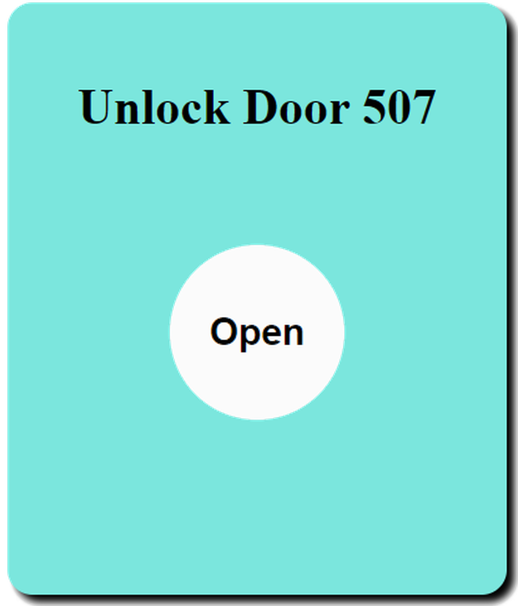

# 第二章——目前门禁版本

## 1. 原理图及 PCB

这个版本我画了 PCB，大家可以到我的这个[Github 仓库](https://github.com/MR-Addict/Door-lock-system.git)下载 Gerber 文件进行 PCB 打样。

原理图如下：


PCB 三维示意图如下：



## 2. 项目文件及代码

下面我简单介绍一下项目文件。

该项目的文件结构如下:

- RFID_ESP32.ino
- WIFI_WS.h
- data
  - favicon.png
  - index.html
  - index.js
  - login.html
  - style.css

其中`RFID_ESP32.ino`包含了主要的控制代码，`WIFI_WS.h`主要是有关包含了有关 WIFI 服务器和 websocket 的配置，而`data文件夹`就是网页服务器相关的文件了。

关于示例代码，我也建议大家前往我的[Github 仓库](https://github.com/MR-Addict/Door-lock-system.git)下载参考，因为这个项目相对来说比较大，代码量相对来说比较多，同时还有网页设计，服务器搭建等等，大家量力而行。

同时，这个项目因为需要把网页内容上传到到 ESP32 中，需要使用到`SPIFFS(SPI Flash File Storage)`技术，关于 ESP32 的 SPIFFS 大家可以参考以下内容:

[Install ESP32 Filesystem Uploader in Arduino IDE](https://randomnerdtutorials.com/install-esp32-filesystem-uploader-arduino-ide/)

如果你不使用 WIFI，那么可以把有关 WIFI 的内容删掉。

在这边我强调几点重要的地方。

### 2.1 第一点

首先为了安全，我在 Arduino 的库文件夹下创建了`arduino_secrets的文件夹`，里面有一个`arduino_secrets.h`的文件，我在里面定义了几个重要的变量，包括办公室网络名，网络密码，默认用户名，默认用户密码：

```cpp
const char* ssid = "STAS-507";
const char* password = "dinghao666";
const char* login_user = "admin";
const char* login_pwd = "dinghao666";
```

当然你也可以将这些变量直接定义在项目文件里。

### 2.2 第二点

你可以通过更改 WIFI_WS 中 WIFI_Init 函数里面以下几行来设置你的`ESP主机名`，这也是[http://unlockdoor-507](http://unlockdoor-507)的由来：

```cpp
// change hostname to unlockdoor-507
String hostname = "unlockdoor-507";
WiFi.mode(WIFI_STA);
WiFi.config(INADDR_NONE, INADDR_NONE, INADDR_NONE, INADDR_NONE);
WiFi.setHostname(hostname.c_str());
```

### 2.3 第三点

由于这个项目跨度比较长，而 Arduino 的`MFRC522.h`库也在不断地改进和完善，目前的版本使用起来更加简单了，但是还是兼容旧版本的。新版本能够直接读取门禁卡数据，解码成 4 个 8 位的数据，因此我用数组存储每张卡的信息。

如下：

```cpp
const uint8_t UID[][4] = {
    {0xF1, 0x41, 0x01, 0x5F}, {0x01, 0x5E, 0x95, 0x2B}, {0x1A, 0xFD, 0xA5, 0x21}, {0xE1, 0xD8, 0xFC, 0x5E}, {0xE1, 0xE0, 0x00, 0x5F},
    {0xD1, 0x7E, 0xFF, 0x5E}, {0x21, 0xDE, 0x01, 0x5F}, {0xD1, 0x3A, 0xF6, 0x5E}, {0x31, 0xAB, 0xFD, 0x5E}, {0x21, 0x35, 0xF7, 0x5E},
    {0x0A, 0x57, 0x80, 0x1C}, {0xFA, 0x5D, 0x70, 0x7F}, {0xD2, 0xAA, 0x1C, 0x3E}, {0x15, 0x4F, 0xB9, 0xE5}, {0x75, 0x89, 0xB6, 0xE5},
    {0x0A, 0x8C, 0x36, 0xB6}, {0x00, 0x69, 0x0F, 0x93}, {0x75, 0x89, 0xB6, 0xE5}, {0xFA, 0x50, 0x35, 0xB6}, {0xEA, 0xB1, 0x1C, 0x3E},
    {0x60, 0xDB, 0x0D, 0x93}, {0x5A, 0x32, 0x34, 0xB6}, {0x72, 0xB1, 0x85, 0x44}, {0xA3, 0xA4, 0x1B, 0x3E}, {0x0C, 0x3C, 0x1A, 0x3F},
    {0x72, 0xB1, 0x85, 0x44}, {0x50, 0xDF, 0xD3, 0x03}, {0xA5, 0x72, 0x1B, 0x3E}, {0xA1, 0xC2, 0x53, 0x74}, {0x6C, 0xAE, 0x73, 0x17},
    {0x0A, 0x46, 0x95, 0x1C}, {0x47, 0x25, 0x38, 0xE1}, {0xDC, 0x53, 0x14, 0x3E}, {0x80, 0x54, 0x0C, 0x93}, {0x2A, 0x76, 0x64, 0x21},
    {0xDC, 0xFB, 0x0E, 0x3F}, {0x5A, 0x20, 0x4C, 0x2D}, {0x3A, 0x79, 0x4E, 0x2D}, {0x08, 0x82, 0xDB, 0x28}, {0x37, 0xF1, 0x20, 0xB3},
    {0x7A, 0xD7, 0x4F, 0x2D},
};
```

你可以通过仓库的另外一个`RFID_READ`程序读取新卡的信息，然后复制到到上面的数组中就可以了。

## 3. 使用方法

目前的门禁是由 ESP32 作为核心，仍然使用 MFRC522 扫描门禁卡，使用步进电机来开门，用蜂鸣器作为提示音，同时使用避障传感器触发中断，兼有 WIFI 功能。

当有人靠近 NFC 时会触发中断，然后 MFRC522 检测是否有门禁卡，如果该门禁卡是内部存储的卡则开门，并伴随两声短促的蜂鸣器声音；没有则不开门，同时蜂鸣器发出两声较长的声音。

你也可以通过 WIFI，访问 ESP32 的内部服务器。在连接办公室网络的情况下，你可以通过[http://unlockdoor-507](http://unlockdoor-507)进行访问，`unlockdoor-507`是 ESP32 的主机名。进入网页的时候需要进行身份验证，默认的用户名是`admin`，默认密码`dinghao666`。



登录成功后点击`open`就可以开门了。


